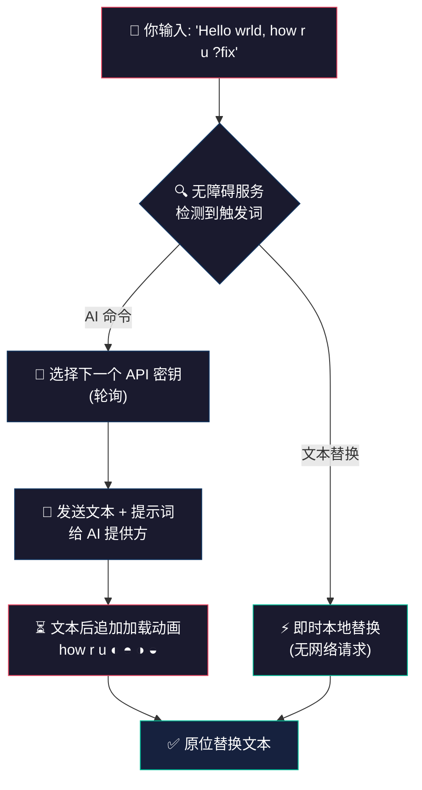

<div align="center">

<br>


<br>

# SwiftSlate

### Android 系统级 AI 文本助手 —— 由 Gemini、Groq 以及任意 OpenAI 兼容接口驱动

在任意 App 的任意文本末尾输入触发命令（如 **`?fix`**），文本就会被**即时**替换为 AI 改写结果。

<br>

[](#-快速开始)
[](#-技术栈)
[](#-支持的-ai-提供方)
[](LICENSE)

[](https://github.com/Musheer360/SwiftSlate/releases/latest)
[](https://github.com/Musheer360/SwiftSlate/releases)
[](https://f-droid.org/en/packages/com.musheer360.swiftslate/)
[](https://github.com/Musheer360/SwiftSlate/stargazers)
[](#)
[](https://github.com/Musheer360/SwiftSlate/actions/workflows/build.yml)

<br>

<a href="https://trendshift.io/repositories/25274?utm_source=repository-badge&utm_medium=badge&utm_campaign=badge-repository-25274" target="_blank" rel="noopener noreferrer"></a>
<a href="https://trendshift.io/repositories/25274?utm_source=trendshift-badge&utm_medium=badge&utm_campaign=badge-trendshift-25274" target="_blank" rel="noopener noreferrer"></a>
<a href="https://trendshift.io/repositories/25274?utm_source=trendshift-badge&utm_medium=badge&utm_campaign=badge-trendshift-25274" target="_blank" rel="noopener noreferrer"></a>

<br>

[](https://github.com/Musheer360/SwiftSlate/releases/latest)
&nbsp;&nbsp;
[](https://github.com/Musheer360/SwiftSlate/issues)
&nbsp;&nbsp;
[](https://github.com/Musheer360/SwiftSlate/issues)

<br>

</div>

> [!IMPORTANT]
> **本仓库是个人 CN 汉化 / 微信适配分支**（默认分支 `cn-zh`），基于 upstream **v1.0.76** 并额外提供：
> - **💬 微信聊天输入框适配** —— 通过 preview 构建内置的「伪装白名单」无障碍服务绕过微信的反无障碍机制，让 `?fix` 等命令在微信里也能用（详见[微信适配](#-微信适配本分支新增)和 [WECHAT_COMPAT.md](WECHAT_COMPAT.md)）
> - **🇨🇳 完整简体中文翻译**（`values-zh` / `values-zh-rCN`，134/134 键全覆盖）
> - **🔍 SwiftSlateDiag 真机诊断日志**（`adb logcat -s SwiftSlateDiag:E`）
>
> 上游原版：[Musheer360/SwiftSlate](https://github.com/Musheer360/SwiftSlate)

> [!NOTE]
> **SwiftSlate 在大多数 App 中都能工作** —— WhatsApp、Gmail、Twitter/X、短信、备忘录等。无需复制粘贴、无需切换 App，直接输入即可。部分使用自定义输入框的 App 可能不受支持（见[已知限制](#-已知限制)）。

> [!TIP]
> **想找 Windows 版？** 看看 [**SwiftSlate Desktop**](https://github.com/Musheer360/SwiftSlate-Desktop) —— 同样的思路，在 Windows 10/11 上系统级生效。

<br>

## 📋 目录

- [快速演示](#-快速演示)
- [功能特性](#-功能特性)
- [内置命令](#-内置命令)
- [文本替换命令](#-文本替换命令)
- [支持的 AI 提供方](#-支持的-ai-提供方)
- [快速开始](#-快速开始)
- [工作原理](#-工作原理)
- [文本选择菜单](#-文本选择菜单)
- [自定义命令](#-自定义命令)
- [API 密钥管理](#-api-密钥管理)
- [备份与恢复](#-备份与恢复)
- [应用界面](#-应用界面)
- [截图](#-截图)
- [本地化](#-本地化)
- [隐私与安全](#-隐私与安全)
- [技术栈](#-技术栈)
- [架构](#-架构)
- [从源码构建](#-从源码构建)
- [试用 Pull Request（不影响已安装版本）](#-试用-pull-request不影响已安装版本)
- [微信适配（本分支新增）](#-微信适配本分支新增)
- [贡献](#-贡献)
- [赞助者](#-赞助者)
- [支持本项目](#-支持本项目)
- [许可证](#-许可证)
- [Star 历史](#-star-历史)

<br>

## ⚡ 快速演示

```
📝  你输入       →  "i dont no whats hapening ?fix"
⏳  你会看到     →  "i dont no whats hapening ◐"  （动画加载中）
✅  结果         →  "I don't know what's happening."
```

```
📝  你输入       →  "hey can u send me that file ?formal"
⏳  你会看到     →  "hey can u send me that file ◐"  （动画加载中）
✅  结果         →  "Could you please share the file at your earliest convenience?"
```

```
📝  你输入       →  "Hello, how are you? ?translate:es"
⏳  你会看到     →  "Hello, how are you? ◐"  （动画加载中）
✅  结果         →  "Hola, ¿cómo estás?"
```

<br>

## ✨ 功能特性

<table>
<tr>
<td width="50%">

### 🌐 几乎随处可用
通过 Android 无障碍服务在系统层面集成。适用于**绝大多数 App** —— 聊天、邮件、社交、备忘录、浏览器等。部分使用自定义输入框的 App 可能不受支持（见[已知限制](#-已知限制)）。

### ✂️ 文本选择菜单
选中任意文本，在复制/分享弹出菜单里点 **SwiftSlate**，选一个命令即可 —— **无需无障碍权限**。凡是提供 Android 文本选择菜单的 App 都能用，包括无障碍流程覆盖不到的 App。

### ⚡ 即时内联替换
输入、触发、完成。AI 回复直接替换原文本，无需复制粘贴、无需切换 App。处理过程中，动画加载符号会追加到你的文本后面（如 `how r u ◐`），让你随时看到进度。文本替换命令则是瞬间执行。

### 🔑 多密钥轮换
添加多个 API 密钥，自动轮换使用。某个密钥触发限流时，SwiftSlate 会自动切换到下一个。

### 🌙 AMOLED 深色主题
为 OLED 屏幕设计的纯黑（`#000000`）Material 3 界面 —— 省电且美观。同样提供浅色主题。

</td>
<td width="50%">

### 🤖 多提供方 AI
内置 Google Gemini、Groq，或连接**任意 OpenAI 兼容接口** —— 云服务商，或局域网里的**本地大模型**，如 [Ollama](https://ollama.com)、[LM Studio](https://lmstudio.ai) 等。

### 🛠️ 两种命令类型
**AI 命令**把文本发送给你的 AI 提供方进行智能改写。**文本替换命令**完全离线运行，用于即时本地文本操作 —— 不需要 API 密钥。

### 🔒 加密密钥存储
API 密钥先用 Android Keystore 做 **AES-256-GCM** 加密再写入磁盘 —— 密钥永远不会以明文形式离开设备。

### 🌍 40 种语言本地化
界面内置 40 种语言，自动跟随系统语言，缺少翻译时回退到英文。

### 🚫 零分析统计
无遥测、无追踪、无崩溃上报 —— 文本只发送给你配置的 AI 提供方，绝不发给任何其他地方。

</td>
</tr>
</table>

<br>

## 🧩 内置命令

SwiftSlate 内置 **9 条 AI 命令**、动态翻译和 **5 条本地命令** —— 开箱即用。AI 命令以可编辑条目形式预置，你可以改写或删除任意一条：

| 触发词 | 作用 | 示例 |
|:--------|:-------|:--------|
| **`?fix`** | 修正语法、拼写与标点 | `i dont no whats hapening` → `I don't know what's happening.` |
| **`?improve`** | 提升清晰度与可读性 | `The thing is not working good` → `The feature isn't functioning properly.` |
| **`?shorten`** | 在保留原意的前提下精简 | `I wanted to let you know that I will not be able to attend the meeting tomorrow` → `I can't attend tomorrow's meeting.` |
| **`?expand`** | 补充更多细节展开 | `Meeting postponed` → `The meeting has been postponed to a later date. We will share the updated schedule soon.` |
| **`?formal`** | 改写为正式语气 | `hey can u send me that file` → `Could you please share the file at your earliest convenience?` |
| **`?casual`** | 改写为轻松语气 | `Please confirm your attendance at the event` → `Hey, you coming to the event? Let me know!` |
| **`?emoji`** | 添加贴切的 emoji | `I love this new feature` → `I love this new feature! 🎉❤️✨` |
| **`?human`** | 让 AI 生成的文本更像人写的 | `I hope this email finds you well. I wanted to delve into...` → `Hope you're doing well. I wanted to dig into...` |
| **`?reply`** | 生成上下文相关的回复 | `Do you want to grab lunch tomorrow?` → `Sure, I'd love to! What time works for you?` |
| **`?undo`** | 恢复上一次替换前的文本 | 回退到 AI 修改之前的原文 |
| **`?translate:XX`** | 翻译成任意语言 | `Hello, how are you?` **`?translate:es`** → `Hola, ¿cómo estás?` |

<details>
<summary>🌍 <strong>翻译支持的语言代码</strong></summary>

<br>

`?translate:XX` 支持任意标准语言代码：

| 代码 | 语言 | 代码 | 语言 | 代码 | 语言 |
|:-----|:---------|:-----|:---------|:-----|:---------|
| `es` | 西班牙语 | `fr` | 法语 | `de` | 德语 |
| `ja` | 日语 | `ko` | 韩语 | `zh` | 中文 |
| `hi` | 印地语 | `ar` | 阿拉伯语 | `pt` | 葡萄牙语 |
| `it` | 意大利语 | `ru` | 俄语 | `nl` | 荷兰语 |
| `tr` | 土耳其语 | `pl` | 波兰语 | `sv` | 瑞典语 |

……还有更多。任意 ISO 639 语言代码都可以 —— 由 AI 模型处理。

</details>

### 📋 剪贴板命令

SwiftSlate 还内置 **4 条剪贴板命令**，完全离线工作，使用 Android 系统真实剪贴板：

| 触发词 | 作用 | 示例 |
|:--------|:-------|:--------|
| **`?copy`** | 把前面的文本复制到剪贴板 | `Hello world?copy` → 复制 "Hello world" |
| **`?cut`** | 剪切前面的文本（复制 + 删除） | `Hello world?cut` → 剪切 "Hello world" |
| **`?paste`** | 在现有文本后粘贴 | 输入 `?paste` → 追加剪贴板内容 |
| **`?replace`** | 用剪贴板内容替换全部文本 | 输入 `?replace` → 用剪贴板内容替换输入框内容 |

> [!NOTE]
> `?paste` 和 `?replace` 适用于你在任何 App 里复制过的内容。自 Android 10 起，无障碍服务**无法读取**剪贴板（只有当前聚焦的 App 和活动键盘可以），所以 SwiftSlate 不尝试读取——而是请文本输入框自己执行粘贴，由 App 在自身焦点下完成。如果输入框忽略该请求，SwiftSlate 会回退到最近用 `?copy` / `?cut` 复制的内容。

<br>

## 🛠️ 文本替换命令

除了 AI 之外，你还可以创建**完全离线**的文本替换命令 —— 不需要 API 密钥、不联网、瞬间执行：

| 用途 | 触发词 | 替换内容 | 效果 |
|:---------|:--------|:------------|:-------|
| **签名** | `?sig` | `— John Doe, CEO` | 追加你的签名 |
| **常用回复** | `?ty` | `Thank you for reaching out! I'll get back to you shortly.` | 即时回复模板 |
| **片段** | `?addr` | `123 Main St, Springfield, IL 62701` | 快速插入地址 |
| **快捷输入** | `?email` | `contact@example.com` | 快速输入邮箱 |

> [!TIP]
> 文本替换命令零延迟瞬间执行 —— 没有加载动画、没有网络请求。在 **命令** 标签页选择 **"文本替换器"** 类型即可创建。

<br>

## 🤖 支持的 AI 提供方

| 提供方 | 模型 | 说明 |
|:---------|:-------|:------|
| **Google Gemini**（默认） | `gemini-3.5-flash-lite`（默认）、`gemini-3.6-flash` | 免费额度见 [aistudio.google.com](https://aistudio.google.com) |
| **Groq** | `openai/gpt-oss-120b`（默认）、`qwen/qwen3.6-27b` | 免费额度见 [console.groq.com](https://console.groq.com/keys) |
| **自定义（OpenAI 兼容）** | 你的接口支持的任何模型 | 兼容 Ollama、LM Studio、vLLM 以及任意 `/v1/chat/completions` 接口 |

> [!TIP]
> 本地大模型请把接口地址设为本机地址（如 Ollama 用 `http://localhost:11434/v1`）。`localhost`、`127.0.0.1`、`10.0.2.2` 允许使用 HTTP。

<br>

## 🚀 快速开始

### 前置要求

| 要求 | 说明 |
|:------------|:--------|
| **Android 设备** | Android 6.0+（API 23 及以上） |
| **API 密钥** | 在 [aistudio.google.com](https://aistudio.google.com) 免费申请 Gemini 密钥，或用 Groq / 任意 OpenAI 兼容提供方的密钥。*文本替换命令不需要。* |

### 安装

> [!TIP]
> APK 只有约 1.4 MB —— 轻量，网络和 JSON 均零外部依赖。

**方式 1 —— F-Droid：**

[](https://f-droid.org/en/packages/com.musheer360.swiftslate/)

**方式 2 —— GitHub Releases：**

**1.** 在 [**Releases**](https://github.com/Musheer360/SwiftSlate/releases/latest) 页面下载最新 APK

**2.** 安装到设备（如提示，允许"安装未知来源应用"）

**3.** 打开 SwiftSlate，按下面的步骤设置

**方式 3 —— 本分支微信适配版（preview）：**

微信会对抗第三方无障碍服务，需要使用本分支的 preview 构建 + 配套兼容服务，见[微信适配](#-微信适配本分支新增)。

### 三步设置

<table>
<tr>
<td width="33%" align="center">

**第一步**

🔑 **添加 API 密钥**

打开 **密钥** 标签页，输入 API 密钥。保存前会校验有效性。可添加多个密钥轮换使用。

</td>
<td width="33%" align="center">

**第二步**

♿ **开启服务**

在 **仪表盘** 点 **"启用"** → 在无障碍设置里找到 **"SwiftSlate 助手"** → 打开开关。

</td>
<td width="33%" align="center">

**第三步**

✍️ **开始输入！**

打开任意 App，输入文本，末尾加上 `?fix` 之类的触发词，见证魔法发生。

</td>
</tr>
</table>

<br>

## ⚙️ 工作原理



<details>
<summary>🔧 <strong>技术细节</strong></summary>

<br>

1. **事件监听** —— SwiftSlate 注册无障碍服务，监听所有 App 的 `TYPE_VIEW_TEXT_CHANGED` 事件（忽略自身界面和密码输入框）
2. **快速退出优化** —— 出于性能考虑，先检查输入文本最后一个字符是否匹配已知触发词的末字符，再决定是否全量扫描
3. **最长匹配** —— 发现潜在匹配后，在文本末尾查找最长的匹配触发词
4. **命令路由** —— 文本替换命令立即在设备本地执行；AI 命令进入 API 调用流程
5. **API 调用** —— 把文本 + 提示词发送给配置的 AI 提供方，按轮询顺序使用下一个可用密钥
6. **内联加载动画** —— 等待 AI 响应期间，触发词会被替换成追加在原文本后的动画符号（如 `how r u ◐`）以显示进度
7. **看门狗定时器** —— 120 秒安全定时器自动取消卡住的处理任务，防止服务失去响应
8. **文本替换** —— 使用 `ACTION_SET_TEXT` 用响应替换原文
9. **回退策略** —— 如果 `ACTION_SET_TEXT` 失败（部分 App 不支持），回退到"全选 + 粘贴"的剪贴板方案
10. **替换后校验** —— 延迟检查确保 IME 没有覆盖替换结果，必要时重新应用
11. **响应上限** —— API 响应限制在 1 MB，防止畸形响应导致内存问题

</details>

<br>

## ✂️ 文本选择菜单

凡是提供 Android 文本选择弹出菜单（带复制、剪切、分享的那个）的 App，都可以把 **SwiftSlate** 作为选项显示出来，无论无障碍服务是否开启：

1. 在任意 App 中选中文本
2. 在弹出的菜单中点击 **SwiftSlate**
3. 选择一条命令
4. 用 **插入**（在输入框允许时原位替换所选文本）或 **复制** 取回结果

它和输入触发词运行完全相同的命令、请求和错误处理 —— 只是通过一次性对话框完成，完成后立即关闭，不需要任何新权限。内置剪贴板命令（`?copy`、`?cut`、`?paste`、`?replace`、`?undo`）在这里不可用，因为它们需要无障碍流程才能访问的实时文本输入框。

<br>

## 🎨 自定义命令

在 **命令** 标签页创建、编辑和管理你自己的命令。

### 两种自定义命令类型

| 类型 | 工作方式 | 需要 API 密钥？ | 延迟 |
|:-----|:-------------|:---------------|:--------|
| **AI** | 把你的自定义提示词连同文本发给 AI 提供方 | 是 | 约 1–3 秒 |
| **文本替换器** | 用固定字符串替换触发词，完全离线 | 否 | 即时 |

### 自定义 AI 命令示例

| 触发词 | 提示词 | 用途 |
|:--------|:-------|:---------|
| `?eli5` | `Explain this like I'm five years old.` | 简化复杂话题 |
| `?bullet` | `Convert this text into bullet points.` | 快速格式化 |
| `?headline` | `Rewrite this as a catchy headline.` | 社交媒体文案 |
| `?code` | `Convert this description into pseudocode.` | 开发者速记 |
| `?tldr` | `Summarize this text in one sentence.` | 快速摘要 |

> [!TIP]
> 直接描述你想要的变换即可 —— SwiftSlate 的系统指令会自动确保 AI 只返回变换后的文本，不附带多余说明。

<br>

## 🔑 API 密钥管理

SwiftSlate 支持多密钥智能轮换：

| 特性 | 说明 |
|:--------|:--------|
| **轮询轮换** | 密钥轮流使用，均衡分散所有已配置密钥的用量 |
| **限流处理** | 某个密钥被限流（HTTP 429）时，SwiftSlate 记录冷却时间并自动跳过 |
| **无效密钥检测** | 返回 401/403 的密钥会被标记为无效并从轮换中排除 |
| **加密存储** | 所有密钥通过 Android Keystore 用 AES-256-GCM 加密后保存到本地 |
| **实时校验** | 保存前会向提供方 API 校验密钥有效性 |

> [!TIP]
> 添加 **2–3 个来自不同账号的 API 密钥** 有助于在重度使用下规避限流。免费额度下，同一账号的所有密钥共享同一配额 —— 所以轮换只对**不同账号**的密钥有效。

<br>

## 💾 备份与恢复

把自定义命令导出/导入为 JSON 文件 —— 便于迁移到新设备或分享命令集。

- **导出** —— 通过 Android 文件选择器把所有自定义命令保存为 `.json` 文件
- **导入** —— 从 `.json` 文件加载命令（导入前会校验格式、触发前缀和大小限制）

两个选项都在 **设置** 标签页的 **备份与恢复** 下。

> [!NOTE]
> 导入的命令必须使用与当前 App 配置一致的触发前缀。出于安全考虑，备份**不包含** API 密钥。

<br>

## 🖥️ 应用界面

SwiftSlate 有**四个界面**，通过底部导航栏访问：

<table>
<tr>
<td width="25%" valign="top">

#### 📊 仪表盘
- 服务状态指示（绿/红）
- 启用/停用开关
- API 密钥数量
- 快速上手指南
- 版本信息与更新检查

</td>
<td width="25%" valign="top">

#### 🔑 密钥
- 添加新密钥（实时校验）
- 删除已有密钥
- AES-256-GCM 加密
- 多密钥管理
- 获取 API 密钥的直达链接

</td>
<td width="25%" valign="top">

#### 📝 命令
- 5 条内置命令（只读）
- 9 条 AI 命令，可像自己的命令一样编辑
- 添加自定义命令（AI 或文本替换器）
- 编辑已有自定义命令
- 删除自定义命令

</td>
<td width="25%" valign="top">

#### ⚙️ 设置
- **提供方选择**（Gemini、Groq、自定义）
- 各提供方的**模型选择器**
- 自定义接口 URL 与模型
- 自定义触发前缀
- 命令备份与恢复

</td>
</tr>
</table>

<br>

## 📸 截图

<div align="center">

**深色模式**

<table>
<tr>
<td></td>
<td></td>
</tr>
<tr>
<td></td>
<td></td>
</tr>
</table>

**浅色模式**

<table>
<tr>
<td></td>
<td></td>
</tr>
<tr>
<td></td>
<td></td>
</tr>
</table>

</div>

<br>

## 🌍 本地化

SwiftSlate 的界面支持 **40 种语言**：

| | | | |
|:--|:--|:--|:--|
| 🇺🇸 英语 `en` | 🇸🇦 阿拉伯语 `ar` | 🇧🇬 保加利亚语 `bg` | 🇪🇸 加泰罗尼亚语 `ca` |
| 🇨🇿 捷克语 `cs` | 🇩🇰 丹麦语 `da` | 🇩🇪 德语 `de` | 🇬🇷 希腊语 `el` |
| 🇪🇸 西班牙语 `es` | 🇪🇪 爱沙尼亚语 `et` | 🇮🇷 波斯语 `fa` | 🇫🇮 芬兰语 `fi` |
| 🇫🇷 法语 `fr` | 🇮🇳 印地语 `hi` | 🇭🇷 克罗地亚语 `hr` | 🇭🇺 匈牙利语 `hu` |
| 🇮🇩 印度尼西亚语 `in` | 🇮🇹 意大利语 `it` | 🇮🇱 希伯来语 `iw` | 🇯🇵 日语 `ja` |
| 🇰🇷 韩语 `ko` | 🇱🇹 立陶宛语 `lt` | 🇱🇻 拉脱维亚语 `lv` | 🇲🇾 马来语 `ms` |
| 🇳🇴 挪威语 `nb` | 🇳🇱 荷兰语 `nl` | 🇵🇱 波兰语 `pl` | 🇵🇹 葡萄牙语 `pt` |
| 🇧🇷 葡萄牙语（巴西）`pt-rBR` | 🇷🇴 罗马尼亚语 `ro` | 🇷🇺 俄语 `ru` | 🇸🇰 斯洛伐克语 `sk` |
| 🇸🇮 斯洛文尼亚语 `sl` | 🇷🇸 塞尔维亚语 `sr` | 🇹🇭 泰语 `th` | 🇹🇷 土耳其语 `tr` |
| 🇺🇦 乌克兰语 `uk` | 🇻🇳 越南语 `vi` | 🇨🇳 中文 `zh` | 🇨🇳 简体中文 `zh-rCN` |

App 自动跟随系统语言，其他情况回退到英语。

添加翻译只需一个目录：把 `values-<locale>/strings.xml` 放进 `app/src/main/res/` 就会自动生效 —— 构建时会根据该目录自动推导发布的语言列表，无需其他修改。欢迎贡献翻译。

<br>

## 🔒 隐私与安全

> [!NOTE]
> SwiftSlate 把隐私作为**核心架构原则**来构建，而非事后补救。

| | 关注点 | SwiftSlate 的处理方式 |
|:--|:--------|:------------------------|
| 👁️ | **文本监控** | 只在文本末尾检测到触发命令时才处理文本，其他所有输入一律忽略。密码输入框永远跳过。 |
| 📡 | **数据传输** | 文本**只**发送给你配置的 AI 提供方（Google Gemini、Groq 或你的自定义接口）。绝不联系任何其他服务器。文本替换命令从不离开设备。 |
| 🔐 | **密钥存储** | API 密钥通过 Android Keystore 用 AES-256-GCM 加密。加密失败会直接抛错，绝不回退到明文。 |
| 📊 | **分析统计** | **完全没有。** 零遥测、零追踪、零崩溃上报。 |
| 📖 | **开源** | 全部代码在 MIT 许可下开放供审查。 |
| 🔑 | **权限** | 仅需要无障碍服务和通知权限。 |
| 💾 | **备份** | API 密钥和设置不参与 Android 云备份和设备迁移。 |

<br>

## 🏗️ 技术栈

<table>
<tr><td><strong>语言</strong></td><td>Kotlin 2.4</td></tr>
<tr><td><strong>UI</strong></td><td>Jetpack Compose · Material 3</td></tr>
<tr><td><strong>异步</strong></td><td>Kotlin Coroutines</td></tr>
<tr><td><strong>HTTP</strong></td><td><code>HttpURLConnection</code>（零外部依赖）</td></tr>
<tr><td><strong>JSON</strong></td><td><code>org.json</code>（Android 内置）</td></tr>
<tr><td><strong>存储</strong></td><td>SharedPreferences（通过 Android Keystore 加密）</td></tr>
<tr><td><strong>后台任务</strong></td><td>WorkManager（每日更新检查）</td></tr>
<tr><td><strong>核心服务</strong></td><td>Android 无障碍服务</td></tr>
<tr><td><strong>构建系统</strong></td><td>Gradle + Kotlin DSL</td></tr>
<tr><td><strong>Java 目标</strong></td><td>JDK 17</td></tr>
<tr><td><strong>最低 SDK</strong></td><td>API 23（Android 6.0）</td></tr>
<tr><td><strong>目标 SDK</strong></td><td>API 36</td></tr>
</table>

> **网络与 JSON 解析零第三方依赖** —— SwiftSlate 只用 Android 内置 API。

<br>

## 🏛️ 架构

```
com.musheer360.swiftslate/
├── service/
│   ├── AssistantService.kt      # 核心无障碍服务 —— 事件监听、触发词
│   │                            # 检测、文本替换、撤销、内联加载动画
│   ├── CommandRunner.kt         # 共享请求策略（密钥轮换、限流退避、
│   │                            # 错误映射），无障碍服务和文本选择弹窗共用
│   ├── ErrorMessages.kt         # 把 provider/网络错误映射为本地化文案
│   └── OverlayToast.kt          # TYPE_ACCESSIBILITY_OVERLAY 通知，带进出场动画
├── api/
│   ├── GeminiClient.kt          # Google Gemini API 客户端
│   ├── OpenAICompatibleClient.kt # Groq 与任意 OpenAI 兼容接口的统一客户端
│   └── ApiClientUtils.kt        # 共享工具 —— 响应解析、错误分类、
│                                # 拒答检测、密钥脱敏、系统提示词
├── manager/
│   ├── KeyManager.kt            # 密钥存储、轮询轮换、限流跟踪、
│   │                            # 无效密钥封禁与过期
│   ├── KeyCipher.kt             # 通过 AndroidKeyStore 做 AES-256-GCM，封装成接口，
│   │                            # 便于 KeyManager 脱离 keystore 测试
│   ├── CommandManager.kt        # 命令增删改查、触发词匹配（最长匹配）、
│   │                            # 前缀迁移、导入/导出
│   └── StatsManager.kt          # 使用统计 —— 月度总量、按命令、最近 7 天
├── provider/
│   └── ProviderConfig.kt        # 各提供方配置（传输方式、接口、模型键、
│                                # 推理/思考参数）+ 注册表
├── model/
│   ├── Command.kt               # 命令数据类（AI 或文本替换器）
│   ├── GeminiModels.kt          # Gemini 模型目录 + 各模型思考级别
│   ├── GroqModels.kt            # Groq 模型目录 + 各模型推理参数
│   ├── PrefKeys.kt              # SharedPreferences 键常量
│   └── ProviderType.kt          # 提供方常量（gemini、groq、custom）
├── ui/
│   ├── DashboardScreen.kt       # 服务状态、密钥数量、使用统计、7 日图表
│   ├── KeysScreen.kt            # API 密钥管理，实时校验
│   ├── CommandsScreen.kt        # 命令列表，可折叠表单增删改
│   ├── SettingsScreen.kt        # 提供方、模型、温度、前缀、备份/恢复
│   ├── processtext/             # ACTION_PROCESS_TEXT 入口（文本选择菜单）
│   │   ├── ProcessTextActivity.kt      # 一次性对话框 Activity，持有底部弹层
│   │   ├── ProcessTextViewModel.kt     # 选择 -> 加载 -> 结果状态机
│   │   ├── ProcessTextInput.kt         # 解析/校验系统提供的选中文本
│   │   └── ProcessTextReplacement.kt   # 把完成的弹窗结果与下一条无障碍事件
│   │                                    # 关联，实现原位自动替换
│   ├── components/              # 可复用 UI 组件（卡片、输入框、分隔线、
│   │                            # 自研底部弹层和通知）
│   └── theme/Theme.kt           # AMOLED 深色 + 浅色 Material 3 配色
├── MainActivity.kt              # AnimatedContent 标签导航（4 个标签）
├── SwiftSlateViewModel.kt       # 共享 ViewModel，暴露 manager 与偏好设置
├── SwiftSlateApp.kt             # Application 类 —— SharedPreferences 预热、
│                                # WorkManager 更新检查调度
└── worker/
    └── UpdateCheckWorker.kt     # 每日后台检查 GitHub 新版本
```

<br>

## 🔨 从源码构建

### 前置要求

- [**Android Studio**](https://developer.android.com/studio)（最新稳定版）
- **JDK 17+**
- 含 API 36 的 **Android SDK**

### 构建

```bash
# 克隆仓库
git clone https://github.com/Musheer360/SwiftSlate.git
cd SwiftSlate

# 构建 debug APK
./gradlew assembleDebug

# 产物：app/build/outputs/apk/debug/app-debug.apk
```

### 安装到设备

```bash
adb install app/build/outputs/apk/debug/app-debug.apk
```

<details>
<summary>📦 <strong>签名 release 构建</strong></summary>

<br>

```bash
export KEYSTORE_FILE=/path/to/your/keystore.jks
export KEYSTORE_PASSWORD=your_keystore_password
export KEY_ALIAS=your_key_alias
export KEY_PASSWORD=your_key_password

./gradlew assembleRelease
```

</details>

<br>

## 🧪 试用 Pull Request（不影响已安装版本）

每个 Pull Request 都会构建一个 **preview APK**，可以和稳定版并排安装。

它以独立 App 形式存在 —— applicationId `com.musheer360.swiftslate.preview`，桌面图标显示为 **SwiftSlate Preview** —— 安装它不会替换你的稳定版，也不会碰它的 API 密钥、命令、统计或无障碍设置。两者在 设置 → 无障碍 下显示为两个独立条目，你想测哪个就开哪个。

1. 打开 Pull Request 的 **Checks** 标签页，选择最新的 **Build & Release** 运行记录
2. 在 **Artifacts** 部分下载 `SwiftSlate-preview-prNNN` 构件
3. 解压并安装 APK，然后在无障碍设置里启用 **SwiftSlate Preview**
4. 用完卸载即可 —— 整个过程不影响你的稳定版安装

preview 构建和 release 一样做了裁剪、不可调试，但用 debug 密钥签名，所以永远不会静默更新你的稳定版。本地构建：

```bash
./gradlew assemblePreview
# app/build/outputs/apk/preview/app-preview.apk
```

<br>

## 💬 微信适配（本分支新增）

> 上游原版在[已知限制](#-已知限制)中写明"微信无法从任何无障碍 App 侧修复"。**本分支做到了。**

### 问题背景

微信 8.0.52+ 内置**反无障碍对抗机制**：检测到非白名单的无障碍服务时，会**清空/伪造**当前窗口的节点树，导致 SwiftSlate 收不到事件、读不到文本、触发不了命令。该机制在客户端按 `package/name` 字符串做白名单匹配（仅两条硬编码：Google 随选朗读和点名手机卫士的类名）。

### 本分支方案

preview 构建内置两个 **no-op 伪装白名单服务**，类名精确等于微信白名单条目 —— 微信看到"白名单服务已启用"，`isAccessibilityEnabled()` 返回 true，停止清空节点树。**仅存在于 preview flavor，稳定版不含**，不冒充真实 Google/点名组件。

### 安装启用（3 步）

1. 构建/安装 preview APK：`./gradlew assemblePreview` → `app/build/outputs/apk/preview/app-preview.apk`
2. 在 设置 → 无障碍 中同时启用 **"SwiftSlate 助手"** 和 **"SwiftSlate 微信适配"** 两个服务（adb 命令见 [WECHAT_COMPAT.md](WECHAT_COMPAT.md) 附录）
3. 打开微信聊天输入框，输入 `hello world ，fix` 等命令即可

已在真机（Realme RMX2202，Android 14）验证：微信节点树完整（`srcNull=false`）、`TEXT_CHANGED` 事件正常、`，fix` 命令端到端替换成功。

### 详细文档

逆向机制、方案对比、逐文件改动清单和上游集成建议见 **[WECHAT_COMPAT.md](WECHAT_COMPAT.md)**（中文版）。

<br>

## ⚠️ 已知限制

- **部分 App 使用自定义输入框**，不支持 Android 标准的文本替换 API。SwiftSlate 内置剪贴板回退和聚焦节点回退，但基于 WebView 或自定义编辑器的记笔记 App（Google Keep、三星备忘录、部分 Zoho 输入框）仍可能忽略替换 —— 在标准文本输入框的 App（WhatsApp、Telegram、Gmail 等）中替换最可靠。[文本选择菜单](#-文本选择菜单) 在所有 App 中都可用，因为它不依赖无障碍服务。
- **微信会主动劣化第三方无障碍服务。** 微信 8.0.52+ 对非白名单服务（系统 App 之外的所有服务）下发清空/伪造节点树和残缺的文本变更事件 —— 由微信自身强制执行。**本分支通过 preview 构建内置的伪装白名单服务绕过了该机制**（见[微信适配](#-微信适配本分支新增)）；使用 stable 版或未启用兼容服务时，请改用[文本选择菜单](#-文本选择菜单)。
- **部分 OEM 限制无障碍服务。** 某些厂商（如 OnePlus、小米）可能在设置界面隐藏或屏蔽第三方无障碍服务。如果 SwiftSlate 没有出现在无障碍设置里，找一下"已下载的应用"或"已安装的服务"区域，或直接搜索。Android 13+ 上，侧载应用还必须先在 **应用信息 → ⋮ → 允许受限设置** 中授权，无障碍开关才能解锁。
- **激进的电池优化可能静默停用服务。** 部分 OEM 皮肤（小米/MIUI、一加/OxygenOS、Infinix/XOS、三星 One UI 等）会在无操作一段时间后杀掉后台无障碍服务以省电，而 Android 本身不允许无障碍服务以前台/常驻服务形式运行来自保。如果 SwiftSlate 运行一段时间后停止响应并在仪表盘显示未激活，最常见的就是这个原因 —— 到无障碍设置重新启用，并按厂商操作：**小米/HyperOS** —— 开启*自启动*，电池策略设为*无限制*，在最近任务中锁定 SwiftSlate，避开超级省电模式（其强停会连带剥夺权限、直接把开关关掉）；**Infinix/XOS 和一加/OxygenOS** —— 电池设为*无限制*/*不优化*并在最近任务中锁定应用；**三星 One UI** —— 电池设为*不受限制*，关闭*不使用的应用自动移除权限*，并把应用移出休眠/深度休眠列表。如果服务真的崩溃了，仪表盘现在会显示"SwiftSlate 已中断"横幅，一键重新启用。
- **部分银行 App 在开启任意无障碍服务时拒绝打开**，包括 SwiftSlate。这是银行 App 完全自主的安全措施 —— 它检查系统已启用的无障碍服务列表，只要该列表非空就自我封锁，与列表里是哪个 App、那个 App 实际做什么无关。没有任何 manifest 标志或 API 能让合法无障碍工具豁免其他 App 自身的检查，所以这不是 SwiftSlate 能修复的。打开受影响的银行 App 前，请先关闭 SwiftSlate 的无障碍权限，用完后重新开启。[文本选择菜单](#-文本选择菜单) 在无障碍关闭时仍然可用，因为它完全不使用该服务。

<br>

## 🤝 贡献

欢迎贡献！参与方式：

```bash
# 1. Fork 本仓库，然后：
git clone https://github.com/YOUR_USERNAME/SwiftSlate.git
cd SwiftSlate

# 2. 创建功能分支
git checkout -b feature/amazing-feature

# 3. 修改并提交
git commit -m "Add amazing feature"

# 4. 推送并提交 Pull Request
git push origin feature/amazing-feature
```

### 贡献方向

- 🧩 新的内置命令
- 🤖 更多 AI 提供方集成
- 🎨 UI 改进和新主题
- 🌍 更多语言的翻译
- 📖 文档改进

<br>

## 💜 赞助者

SwiftSlate 的持续开发离不开赞助者的慷慨支持。谢谢！

<table>
<tr>
<td align="center">
<a href="https://github.com/lifearien">
<br>
<strong>@lifearien</strong>
</a>
</td>
</tr>
</table>

想在这里看到你的名字？[**成为赞助者 →**](https://github.com/sponsors/Musheer360)

<br>

## ❤️ 支持本项目

SwiftSlate 免费、开源，用我的业余时间开发。如果它对你有用，请考虑支持它的发展：

- ⭐ **给仓库点个 Star** —— 帮助更多人发现 SwiftSlate
- 💖 [**在 GitHub 上赞助**](https://github.com/sponsors/Musheer360) —— 哪怕一点贡献也能让项目继续

<br>

## 📄 许可证

本项目基于 **MIT 许可证** —— 详见 [LICENSE](LICENSE) 文件。

<br>

## 📈 Star 历史

<div align="center">

<a href="https://star-history.com/#Musheer360/SwiftSlate&Date">
  <picture>
    <source media="(prefers-color-scheme: dark)" srcset="https://api.star-history.com/svg?repos=Musheer360/SwiftSlate&type=Date&theme=dark" />
    <source media="(prefers-color-scheme: light)" srcset="https://api.star-history.com/svg?repos=Musheer360/SwiftSlate&type=Date" />
    
  </picture>
</a>

</div>

<br>

---

<div align="center">

<br>

由 [**Musheer Alam**](https://github.com/Musheer360) 用 ❤️ 制作

CN 汉化 / 微信适配分支：[**guoxpeng**](https://github.com/guoxpeng) · 上游：[**Musheer360/SwiftSlate**](https://github.com/Musheer360/SwiftSlate)

如果 SwiftSlate 让你的打字更轻松，给它点个 ⭐ 吧

<br>

</div>
